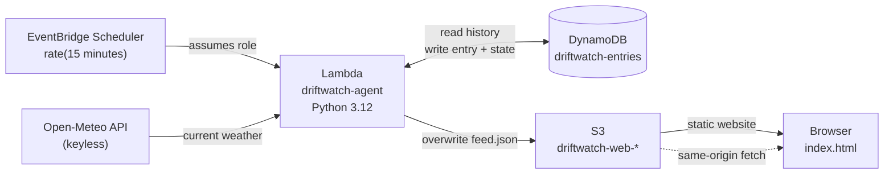
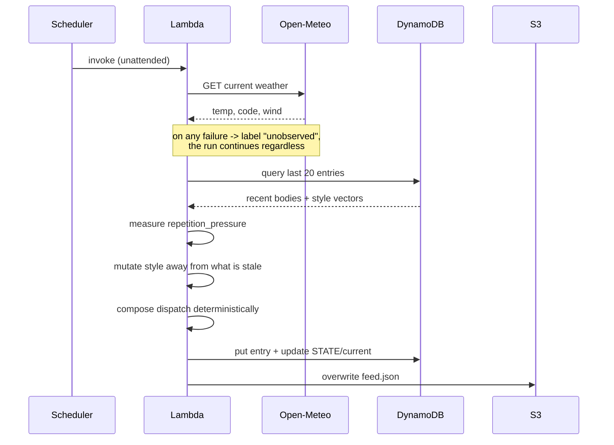

# Driftwatch

**An unattended observation post that files dispatches from a coastline that does not exist.**

Every 15 minutes, with no human involved, Driftwatch reads the real weather over
Bengaluru and writes a short dispatch about an imaginary shore. Nobody operates
it. You visit and read what it has been doing while you were gone.

The second mechanism is the point: **the agent's prose style drifts based on its
own accumulated output.** Each run it measures how much it has been repeating
itself, and when it detects staleness it deliberately pushes its own voice
somewhere new — changing sentence length, ornamentation, and vocabulary bank.
Those parameters persist between runs. Over hundreds of dispatches the voice
measurably moves, and the site charts that movement.

**Live:** http://driftwatch-web-232351199908.s3-website-us-east-1.amazonaws.com

---

## Architecture



There is no API Gateway and no public endpoint. The Lambda writes a static
`feed.json` to the same bucket that serves the site, so the browser makes one
same-origin request for a flat file. No CORS configuration, no credentials in
the client, no request path that can fail under load.

### What happens in a single run



---

## The drift mechanism

Four parameters define the agent's voice at any moment.

| Parameter | Range | Effect |
|---|---|---|
| `sentence_target` | 6–24 | mean words per sentence |
| `austerity` | 0.0–1.0 | 0 = ornate word banks, 1 = plain |
| `lexicon` | tidal, mineral, avian, mechanical, botanical | which imagery bank dominates |
| `repetition_pressure` | 0.0–1.0 | measured, not chosen |

Before composing, every run loads its last 20 dispatches and computes what
fraction of content words appear more than twice. Below 0.35 the agent nudges
its parameters gently, seeded from a hash of the previous body so the movement
is deterministic and reproducible rather than random. Above 0.35 it is stuck,
and it pushes hard: it switches to the least-used lexicon and moves both numeric
parameters away from their recent mean.

`drift` is the normalised distance between consecutive style vectors. It is the
number plotted on the site.

Observed on the first day of operation:

```
seq 1  drift 0.00  tidal      first run, nothing to differ from
seq 2  drift 0.03  tidal      gentle nudge
seq 4  drift 0.16  tidal      larger move
seq 5  drift 0.03  tidal      gentle again
seq 6  drift 0.52  mineral    repetition threshold crossed, vocabulary switched
```

That jump at seq 6 was not scheduled or configured. The agent measured five
consecutive runs of tidal imagery, judged itself stale, and changed its own
vocabulary bank.

---

## No hosted model

Generation is deterministic Python. Amazon Bedrock is blocked account-wide on the
account this was built on — confirmed across two model families with
`AdministratorAccess` attached, every call returning
`ValidationException: Operation not allowed`.

This constraint improved the project. "The agent's style evolves over time" is
an unfalsifiable claim when a language model is doing it — you cannot inspect the
mechanism or prove the change. With explicit numeric parameters, the drift is
measurable, chartable, and reproducible: the same `(seq, style, weather)` always
produces the same dispatch.

---

## AWS services

| Service | Role |
|---|---|
| Amazon EventBridge Scheduler | fires the agent every 15 minutes, unattended |
| AWS Lambda | Python 3.12 runtime, no dependencies beyond boto3 |
| Amazon DynamoDB | dispatch history and the persistent style vector |
| Amazon S3 | static site hosting and the JSON feed |
| Amazon CloudWatch Logs | the autonomy audit trail |
| AWS IAM | two roles — one the scheduler assumes, one the function assumes |

All within AWS Free Tier.

---

## Repository layout

```
infra/     deploy scripts, bucket setup, build notes
lambda/    handler.py, compose.py, drift.py, weather.py, feed.py
web/       index.html — vanilla, no build step, no CDN
CONTRACT.md   frozen interface: data shapes, drift rule, feed format
CLAUDE.md     build rules and the environment failure catalog
```

## Running it yourself

```bash
export MSYS_NO_PATHCONV=1
export AWS_PAGER=""
export AWS_DEFAULT_REGION=us-east-1

bash infra/setup-s3.sh      # bucket, public policy, website hosting
bash infra/redeploy.sh      # zip lambda/, update function, invoke once, tail logs
aws s3 sync web/ s3://<your-bucket>/ --exclude "feed.json"
```

The DynamoDB table, Lambda function, IAM roles and schedule are created once —
see `infra/NOTES.md` for the exact commands and the surprises encountered.

## Verifying autonomy

```bash
aws logs tail /aws/lambda/driftwatch-agent --since 1h --format short | grep wrote
```

Entries appearing exactly 15 minutes apart that you did not trigger are the
whole point.
